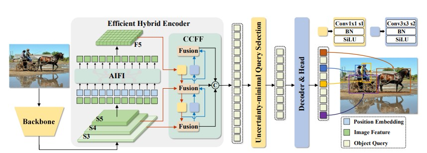
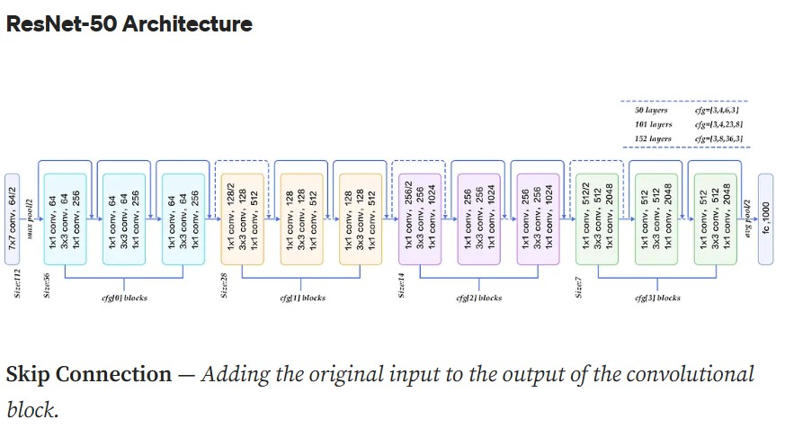
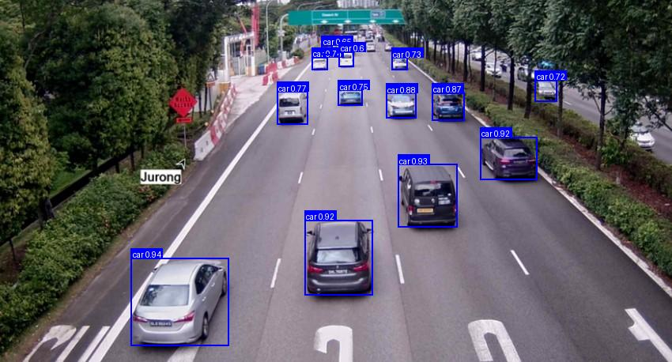
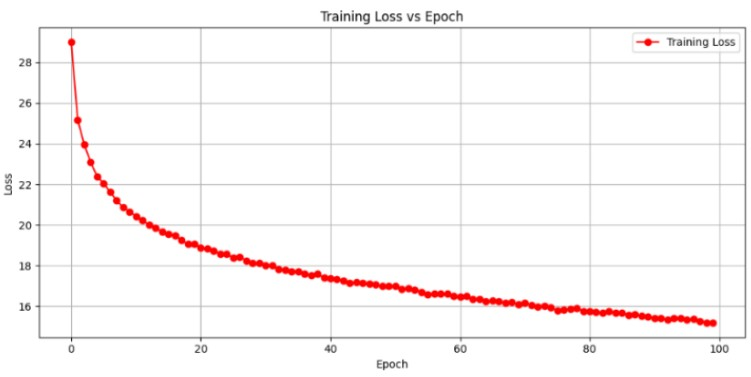
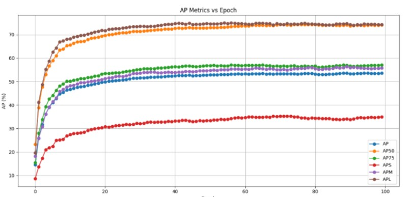

# Enhanced RT-DETR: Real-Time Object Detection  
*By Mahesh*

---

## Introduction  

Real-time object detection is at the heart of modern AI applications — from autonomous vehicles identifying pedestrians and traffic lights, to smart city surveillance monitoring vehicles, to drones detecting obstacles in-flight.  

Traditionally, models like **YOLO (You Only Look Once)** dominated real-time detection because of their speed. However, YOLO and other CNN-based detectors rely heavily on **Non-Maximum Suppression (NMS)**, which can slow inference and add extra hyperparameters.  

This is where **RT-DETR (Real-Time DEtection TRansformer)** comes in.  
It is the **first NMS-free, end-to-end transformer-based real-time detector** that balances accuracy, speed, and training stability.  

In this blog, we will break down RT-DETR architecture step by step in beginner-friendly terms, explain every building block, and finally show **our improvements (data augmentation + custom class filtering + retraining)** that boosted performance.  

---

## RT-DETR Architecture – Step by Step  

RT-DETR is based on **DETR (Detection Transformer)** but optimized for real-time scenarios. Let’s break it down into its core modules: 

  

---

### 1. Backbone – ResNet-50 (Feature Extractor)  

The **backbone extracts features** from the input image. Think of it like turning a raw photo into a map of **edges, textures, and shapes**.  

**Model used:** ResNet-50 (Residual Network with 50 layers).  

**Why ResNet?**  
Deep networks usually suffer from **vanishing gradients** (training becomes unstable). ResNet solves this with **skip connections** that let gradients "skip over" layers.  

**How ResNet-50 works inside:**  

1. **Image preprocessing** → Input resized to 640×640.  
2. **7×7 Conv + Stride 2** → Shrinks the image by half.  
3. **Max pooling** → Further downsamples.  
4. **Residual Blocks**:  
   - 1×1 Conv (reduce channels)  
   - 3×3 Conv (extract features)  
   - 1×1 Conv (restore channels)  
   - Skip connection adds input back → prevents information loss.  

**Multi-scale outputs (S3, S4, S5):**  
- **S3** → medium-resolution, keeps spatial details.  
- **S4** → more abstract, semantic info.  
- **S5** → strongest semantic features but lower spatial detail.  

These feature maps form the input to the Hybrid Encoder.  

  

---

### 2. Efficient Hybrid Encoder  

Transformers normally use **self-attention on every pixel pair** → very expensive.  
RT-DETR redesigns the encoder into two lightweight modules:  

**(a) AIFI (Attention in Feed-forward Interaction)**  
- Learns which channels and regions are important.  
- Example: If detecting a car, it will emphasize **wheel + roof features** while ignoring background sky.  

**(b) CCFF (Conditional Channel Fusion Feedforward)**  
- Fuses channels differently for each feature map.  
- Example: When detecting a person, **skin texture channels** may be amplified; for cars, **metallic edges** get priority.  

**Together, AIFI + CCFF = rich, efficient context modeling.**   

---

### 3. Uncertainty-Minimal Query Selection  

In DETR, object queries are **random learnable embeddings**. RT-DETR improves this.  

- **Problem:** Sometimes queries lock onto background, wasting capacity.  
- **Solution:** Choose queries that **minimize uncertainty** (high localization + high class confidence).  
- **Benefit:** Decoder starts with *better guesses*, leading to faster convergence and higher AP.  

Example: Instead of guessing random 300 spots, queries first lock onto **“likely object” regions** like cars or people before refinement.  

---

### 4. Transformer Decoder – Object Queries  

The **decoder takes encoder features + queries** and iteratively refines predictions.  

- **Object Queries (e.g., 300 vectors):** Each query = “try to find one object.”  
- **Multi-Head Attention (8 heads):** Each head looks at features differently (color, shape, position).  
- **Feed Forward Layers (SiLU / GELU activations):** Predicts class + bounding box.  
- **6 Decoder Layers:** Each layer refines predictions from the last.  

**No NMS needed!** The decoder already ensures one prediction per object.  

---

### 5. Loss Function – Hungarian Matching  

Instead of NMS, RT-DETR uses **set-based Hungarian Matching**:  

- Model predicts 300 boxes, but ground truth may only have 5.  
- Hungarian algorithm finds the **best match** by minimizing cost:  

$$
\text{Matching Cost} = \text{Classification Loss} + \lambda_1 L1 \text{ Loss} + \lambda_2 GIoU \text{ Loss}
$$


- **Classification Loss** → wrong label penalty  
- **L1 Loss** → distance between predicted and true box  
- **GIoU Loss** → overlap quality  

This ensures **one-to-one assignment** between predictions and objects.  

---

## Improvements  

Built on top of the base RT-DETR and applied key modifications:  

---

### 1. Dataset Filtering – Focused 11 Classes  

Instead of using all 80 COCO classes, we curated **11 traffic-relevant classes**:  

Person, Bicycle, Car, Motorcycle, Airplane, Bus, Truck, Traffic Light, Fire Hydrant, Stop Sign, Parking Meter.  

**Benefit:** Reduces noise, speeds training, improves focus.  

---

### 2. Data Augmentation  

We applied a **custom augmentation pipeline** to improve robustness:  

- **RandomPhotometricDistort (p=0.5):** simulate lighting variations  
- **RandomZoomOut:** mimic zoom-out cameras  
- **RandomIoUCrop (p=0.8):** simulate close-up crops  
- **RandomHorizontalFlip:** mirror scenarios  
- **Resize (640×640):** uniform input size  
- **SanitizeBoundingBox:** remove invalid boxes  

**This made the model generalize better in lighting, scaling, and angles.**  

**Implementation Detail:**  
The data augmentation pipeline is implemented in `dataloader.yml`. During training, **every input image is randomly augmented** according to these transformations, ensuring the model sees diverse variations and improves generalization in lighting, scaling, and angles. 

---

### 3. Optimizer & Training Setup  

- Optimizer: **AdamW**  
- Learning rate: `1e-4` (backbone: `1e-5`)  
- Weight decay: `0.0001`  
- Scheduler: **MultiStepLR** (milestone: 1000, gamma=0.1)  
- Epochs: **100**  
- Batch size: **8**  
- EMA: **Exponential Moving Average** for stable weights  

The model was trained for **100 epochs** using the filtered dataset and data augmentation. After training, the **best checkpoint weights** were selected based on validation performance.  

Inference was then performed on the following sample image and video using these best weights:  

  


---

## Results  

| Metric | Base RT-DETR | Our Improved RT-DETR |  
|--------|--------------|----------------------|  
| AP@[0.50:0.95] | 53.10 | **53.57** |  
| AP@0.50 | 71.30 | **74.31** |  
| AP@0.75 | 57.70 | 57.09 |  
| AP (Small) | 34.80 | **35.30** |  
| AP (Medium) | 58.00 | 56.36 |  
| AP (Large) | 70.00 | **74.96** |  

**Key Gains:**  
- +0.47 AP overall  
- +4.96 AP on large objects  
- Better robustness under augmentation  

Training Loss Curve:  
  

AP Curve:  
  

---

## Inference – Images & Videos  

```bash
# Image inference
python C:\Users\rtdetr_pytorch\tools\infer.py -c C:\Users\rtdetr_pytorch\configs\rtdetr\rtdetr_r50vd_6x_coco.yml -r C:\Users\rtdetr_pytorch\model.pth -f C:\Users\mages\rtdetr_pytorch\samples\sample_image.jpg -d cuda

# Video inference
python C:\Users\rtdetr_pytorch\tools\infer.py -c C:\Users\rtdetr_pytorch\configs\rtdetr\rtdetr_r50vd_6x_coco.yml -r C:\Users\rtdetr_pytorch\model.pth -f C:\Users\mages\rtdetr_pytorch\samples\sample_video2.mp4 -d cuda

---

## Limitations and Further Improvements

- Small object detection improved only slightly  
- RT-DETR modifications require high GPU memory.
- Extra modules (FPN, SPP, ASPP) didn’t improve AP beyond augmentation  

## Further Improvements

**Generalization Challenges:**  
Model trained on COCO may need fine-tuning for domain-specific applications.  
*Example:* Medical Imaging, Robotics, Agriculture, etc.

---

## Bibliography 

1. Glenn Jocher. YOLOv8: Ultralytics 2023. GitHub  
2. Wang et al., YOLOv7: Trainable bag-of-freebies sets new SOTA for real-time object detectors. CVPR 2023  
3. Chien-Yao Wang et al. RT-DETR: Real-Time Detection Transformers. Arxiv  
4. Zhiqiang Shen. Detection Transformers: A Comprehensive Guide. Springer, 2024  
5. Jason Smith. Deep Learning for Object Detection: From Theory to Practice. Wiley, 2022  

---

## Appendix

### 1. Hardware Configuration – JetStream2

- Processor: AMD EPYC-Milan (16 Cores, 2.0 GHz)  
- Graphics: NVIDIA A100 SXM4 40GB  
- RAM: 60 GiB (ECC Enabled)  
- Storage: 250 GiB Virtual Disk (QEMU)  

This configuration was sufficient to support high-performance training for transformer-based object detection models like RT-DETR and its variants.

### 2. Platform / Tools Used

- Operating System: Linux (Ubuntu 20.04)  
- IDE / Development Tools: Visual Studio Code, Jupyter Notebook  
- Programming Language: Python  
- Frameworks: PyTorch, TorchVision, NumPy, Matplotlib  
- Version Control: Git & GitHub  

### 3. Data Description

The COCO dataset, developed by Microsoft, is a benchmark dataset for object detection, segmentation, and captioning tasks. It includes:  

- 330,000+ images  
- 80 object categories  
- Over 2.5 million labeled instances  

The dataset is used as-is without any modification or augmentation.  
**Dataset Source:** [https://cocodataset.org](https://cocodataset.org)  

### 4. Model Architecture and Hyperparameters

The base model is **RT-DETR R50**, which includes a ResNet-50 backbone and transformer-based encoder-decoder architecture.

**Shared Hyperparameters:**  

- Epochs: 72 to 100  
- Batch Size: 16  
- Learning Rate: 1e-4 (with step decay)  
- Optimizer: AdamW  
- Weight Decay: 1e-4  
- Loss Function: Hungarian Loss + Bounding Box Regression + Classification Loss  

### 5. Training Procedure

1. Evaluation is performed on the COCO validation set.  
2. The training pipeline includes data loading, normalization, and label formatting.  
3. All models use checkpointing, learning rate scheduling, and logging via custom training loops.  

Epoch-wise evaluations are carried out at epoch 8, 16, 24 and projected for epoch 72 to 100. Training is monitored using loss curves and AP metrics logged during and after each epoch.

### 6. Evaluation Metrics

Standard COCO evaluation protocol is used:  

1. **Average Precision (AP):** Calculated for small, medium, and large objects  
2. **IoU (Intersection over Union) Thresholds:** 0.50 to 0.95 with a step of 0.05  
3. **AP:** Focus metric for the RT-DETR enhancements

---

## Conclusion

RT-DETR is a game-changer in object detection:  

- Removes the need for NMS  
- Learns object queries end-to-end  
- Provides real-time inference without post-processing  

With our improvements (class filtering + augmentation + retraining), we achieved higher AP and better performance, especially for large objects.  

This makes RT-DETR not just a research paper model, but a practical solution for traffic, mobility, and surveillance systems.  

**Enhanced RT-DETR Resources:**  

- [Enhanced RT-DETR Final Report](https://example.com/enhanced_rtdetr_report)  
- [Enhanced RT-DETR GitHub Repository](https://github.com/yourusername/enhanced_rtdetr)

---

## References

- [RT-DETR Original Paper](https://arxiv.org/abs/2206.01191)  
- [RT-DETR Base paper GitHub](https://github.com/IDEA-Research/RT-DETR)  
- [Non-Maximum Suppression (NMS)](https://en.wikipedia.org/wiki/Non-maximum_suppression)  
- [Roboflow RT-DETR Tutorial](https://blog.roboflow.com/rtdetr/)  
 